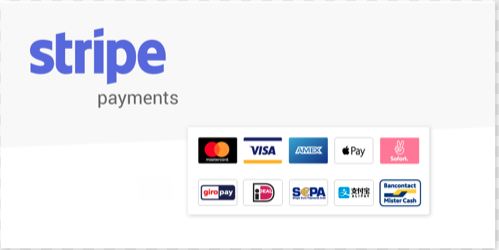
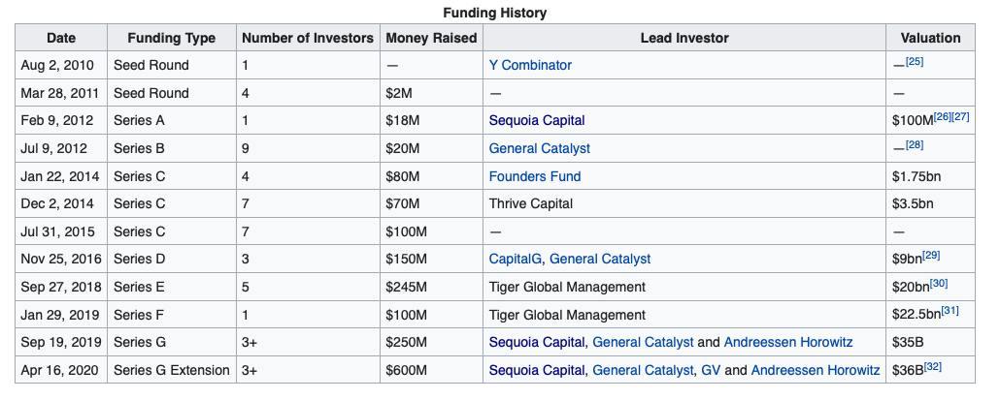
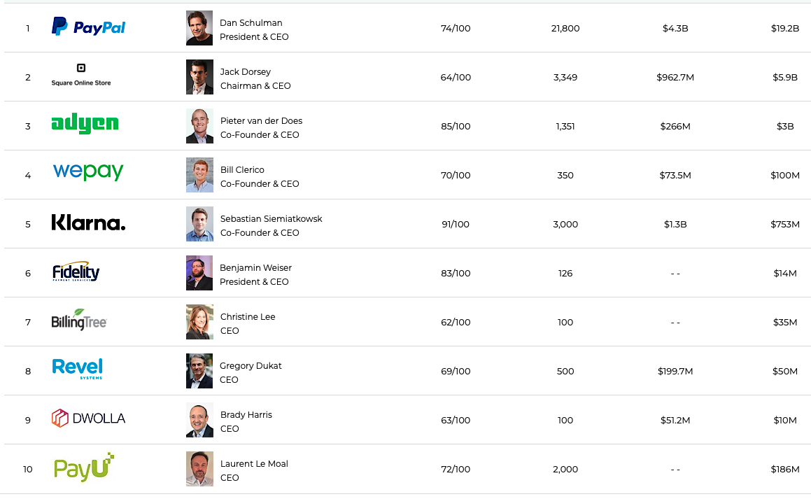

# Stripe Case Study



## Stripe the future of Online payments

* Stripe

* When was the company incorporated? Stripe was foinded in 2010 un the name of /dev/payments. 

* Who are the founders of the company?
Stripe was fouinded by John and Patrick Collison.  The Collison brothers are from Irerland and Patrick won the Young Scientist and Technology Exhibit in 2005 at the age of 16.
* How did the idea for the company (or project) come about? 
"John and Patrick first started working on Stripe in early 2010.  The inspiration came when Patrick, who was working on a few side projects, kept complaining about how difficult it was to accept payments on the web.  The two quickly developed a simple solution and within 2-weeks they had processed their first transaction.  Over the next 6-months they showed it to friends, watched people interact with it, and iterated as fast as they could."

* How is the company funded? How much funding have they received?
Stripe recieved an intial start up of $2 million dollars from Y Combinator (YC) a firm that provides seed money for new start-up.  The company has recieved 10 additional rounds of funding, bring the total amount raised to $600 million.  See the picture below for a detailed list of funding rounds. Referance (Wikipedia)




## Business Activities:..

* What specific financial problem is the company or project trying to solve?


Stripe was founded to address the issuse of online payments moreove how to simplify online payments, by being focused on the developers.  They set upa platform that could be setup instanly for anysize merchants.


* Who is the company's intended customer?  Is there any information about the market size of this set of customers?

 Stripe is part of the digital payment industry that has roughly a $50 billion dollar market.  The compay curently has over 3500 customers that range from Lyft, DoorDash, postmates, MasterCard and Accenture to name a few.  Stripe currently targets any company that provides an online market place.
 What solution does this company offer that their competitors do not or cannot offer? (What is the unfair advantage they utilize?)
 Strip offers four major and distenct competitve services: 1)Customizable: Stripe’s API is a big part of why it’s so widespread. If you’re comfortable writing code or have someone in-house who is, you’ll have a great playground to work in with excellent documentation. Not technical? There are tons of prebuilt store pages, configurations, and integrations to choose from.
 2)Global: One of the most significant benefits of eCommerce is the ability to, theoretically, sell anywhere in the world. In practice, there are a lot of complications to doing business outside of your borders. Stripe makes it a lot easier by supporting over 135 currencies (it’s available to merchants in 34 countries) as well as helping you navigate local policies, such as VATs and sales tax.
 3)Competitive Pricing: It’s not the cheapest service of its kind, but Stripe’s flat rates are predictable and transparent, and you get a lot of value for what you pay.
 4)Billing & Subscription Management: Stripe supports recurring payments, making it easy to offer subscription-based services or products.  Refferance (https://www.merchantmaverick.com/stripe-payments-competitors-and-alternatives/)

* Which technologies are they currently using, and how are they implementing them? (This may take a little bit of sleuthing–– you may want to search the company’s engineering blog or use sites like Stackshare to find this information.)


According to an interview with Patrick Collison had with Christian Van Der Henst, the company uses the foloowing technologies: Ruby, Go, JavaScript and Swift on mobile. (Referance https://courses.platzi.com/blog/building-stripe/)

## Landscape:


* What domain of the financial industry is the company in?


The Company is based in the digital payment industry.

* What have been the major trends and innovations of this domain over the last 5-10 years?

Stripe has been the leader in developping and API (Application Programming Interface), that has forced other major players i.e Paypal to increase their API game.  They also created and support libraries for most programming languages, that helps developers save time when writitng code.

* What are the other major companies in this domain?
Stripe has some major compitition in the digital payment arena, Paypal being the most well know in the industry.

  

## Results

* What has been the business impact of this company so far?
Stripe has revolutionized the digatail payment industry with its robust API system and its abliity to provide leading technologies to freelance developres.

* What are some of the core metrics that companies in this domain use to measure success? How is your company performing, based on these metrics?

* How is your company performing relative to competitors in the same domain?
Stripe contunies to be the leader iun the industry as it quietly took over Ammazon's e comerce business, along with offering machine learning system


## Recommendations

* If you were to advise the company, what products or services would you suggest they offer? (This could be something that a competitor offers, or use your imagination!)
I would advise stripe to offer a multi-level fee structure for small business.  Stripe currently offers a flat rate fee structure.  This fee structure is great for large bussines, however it makes their product more expensive for small business.  PayPal has a better fee structure for small business.

* Why do you think that offering this product or service would benefit the company?

By offering a multi-level fee structure, Stripe would be able to capture even more of the digital payments from small business, and thus increasing their overall revenue.

* What technologies would this additional product or service utilize?

Stripe could leverage their current API for the new fee structure.

* Why are these technologies appropriate for your solution?

THe robust API will allow devlepers to help creat the new fee structure.
```


Adendum 

Wikipedia, 
(Referance https://courses.platzi.com/blog/building-stripe/)
Refferance (https://www.merchantmaverick.com/stripe-payments-competitors-and-alternatives/)


#### 4. Write the case study.

Write the finished case study report in a markdown `README.md` file, using the above case study template. Your report should be sufficiently long to ensure you provide all relevant information about the company or project in a thorough manner.

Be sure to cite your sources in an addendum at the end of the report. List all websites, podcasts, blogs, or articles that you consulted in order to write the report, and provide links. Your list should be thorough and account for all sources you used, but it does not need to be a formal works cited page.


#### 5. Upload your case study to your git repository.

You learned some technical aspects of FinTech this week, including how to set up and populate a git repository. As a final step, take your finished case study and upload it to a repository to share with your instructor and class.

---